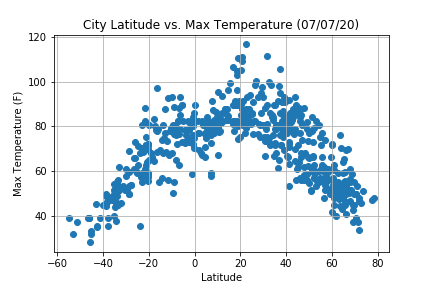
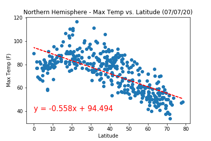
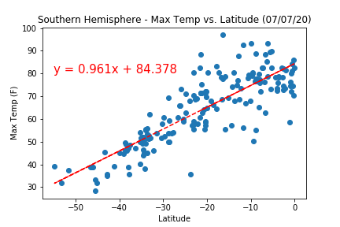
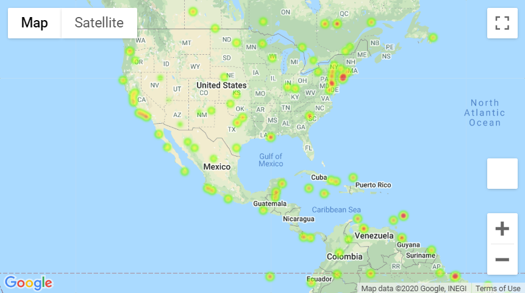
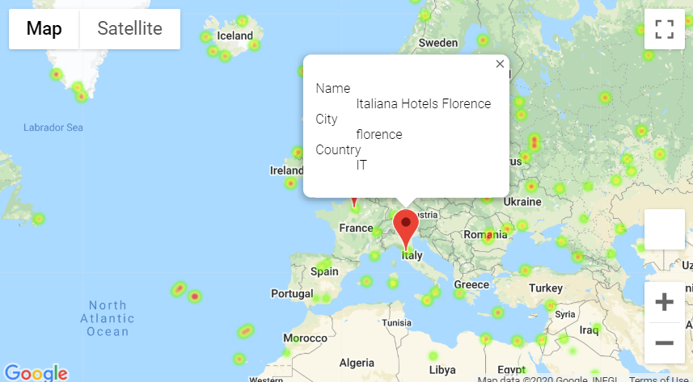

#### [View this project on GitHub](https://github.com/jgabunilas/python-api-challenge)  

## Project Summary 

This exercise analyzes various properties of local weather as a function of location, seeking to understand whether temperature, cloudiness, windiness, or humidity for a given city is correlated with its latitudinal positioning. It makes extensive use of the following tools:

- Pandas - data cleanup and organization
- Matplotlib - data visualization
- Scipy - regression analysis
- Requests - API requests

---

## Part I: WeatherPy
In the first part of this analysis, weather data retrieved from the OpenWeather API is organized to determine whether a city's latitudinal position may be related to various properties of the weather. 

1. A random but uniform set of latitude, longitude coordinates is created using the **Numpy** `random` module and stored in a list.

2. The **CityPy** library is used to identify the nearest city for each set of coordinates, appending each city name to a list called `cities`.

3. Empty lists are initiated to store the following information for all cities:

- A serialized list of numbers to identify each city. The list is filled sequentially, each with the ID incrementing by 1 each time a city is added
- The names of the cities
- The latidude coordinate of the city
- The longitude coordinate of the city
- The maximum observed temperature for the city (in deg Fahrenheit)
- The relative humidity for that city (%)
- The wind speed (mph)
- The cloudiness (%)
- The country that the city is located in
- The date of data retrieval

4. The [OpenWeather API](https://openweathermap.org/current) is queried for each city in the `cities` list using the `requests.get()` method, which returns a JSON object containing weather information for each city. The name of each city is printed to the console as the queries proceed. If a query fails to return data for a given city and throws a **404** error, the query moves on to the next city in the list. 

5. The lists that were created in (3) to store weather data are populated by parsing the weather JSON object for the pertinant data. One datapoint is added for each successful query. 

6. Pandas is used to construct a dataframe (`city_df`) with all of the data collected in the now-populated lists. The dataframe contains one row for each city that successfully returned a response. 

7. The dataframe is "cleaned" to remove any cities that report a relatively humidity of greater than 100%.

8. The data is exported into a CSV file for use in Part II

9. Matplotlib is used to construct scatter plots displaying the relationship between latitude and four properties of the weather: temperature, humidity, wind speed, and cloudiness.

10. To further quantify these relationships, the `linregress` function is imported from `scipy.stats` to perform linear regression analysis on the data. Regression lines and equations are added to the plots using Matplotlib. For these analyses, the data is divided into latitudinal coordinates that are within the Northern or Southern hemispheres.

All visualizations comparing weather properties against latitude can be viewed at [this webpage](https://jgabunilas.github.io/Web-Design-Challenge/).

---

## Part II: VacationPy
Perhaps more interesting than the weather information are the actual decisions one can make with that data. In Part II, the weather data acquired from WeatherPy is used to determine the top  ideal cities matching the weather preferences of a would-be vacationer and searches for nearby lodging within those cities. 

1. VacationPy begins by using Pandas to read in the CSV file containing cities and weather information from Part I and load the data into a dataframe (`cities_df`).

2. A humidity heatmap is generated using the `gmaps` library. The latitude and longitude coordinates as well as the humidity data for the cities in the dataframe are passed to the `heatmap_layer` function to create heatmap visualizing the humidity data for each city.

 

4. The `cities_df` dataframe is filtered into a new dataframe called `ideal_weather` using Pandas to filter the cities by the weather preferences. For this exercise the following conditions were applied:
- Maximum temperature between 68 and 80 degrees F
- Wind speed of less than 8 mph
- Cloudiness of less than 20%
- Humidity of less than 50%

4. Next, a new column titled "Hotel Name" is added to the dataframe in order to store the names of hotels located in the top cities. 

5. Using the `itterows()` function, the top cities dataframe is iterated over to collect the latitude and longitude coordinates for each city. These are then passed as parameters into requests to the Google Place API. Additional parameters specify that the search is looking for lodging within 5000 meters of the city location. 

6. The query returns a JSON object containing information about lodging facilities meeting the parameters, one lodging per city. The object is parsed for the name of the lodging, which is then added to the "Hotel Name" column of the dataframe.

7. Finally, `gmaps` is used to add a marker layer to the humidity heatmap created in step (2). The markers indicate the locations of the top cities matching the filtered weather preferences. When clicked, the hotel name, city, and country are displayed.  

